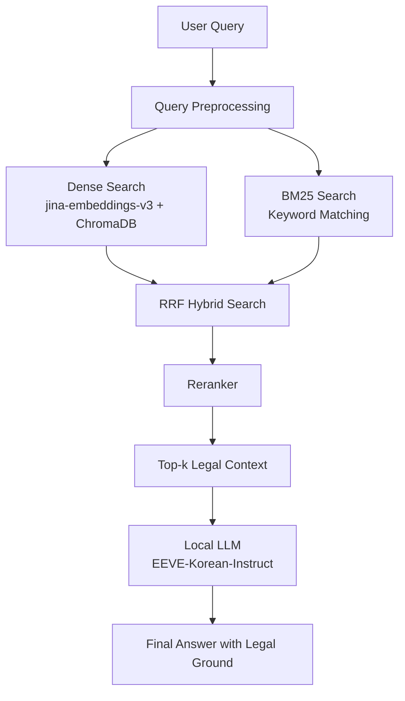

# Pipeline Diagram

```mermaid
flowchart TD
    A[User Query] --> B[Query Preprocessing]
    B --> C[Dense Search<br/>jina-embeddings-v3 + ChromaDB]
    B --> D[BM25 Search<br/>Keyword Matching]
    C --> E[RRF Hybrid Search]
    D --> E
    E --> F[Reranker]
    F --> G[Top-k Legal Context]
    G --> H[Local LLM<br/>EEVE-Korean-Instruct]
    H --> I[Final Answer with Legal Ground]
```
