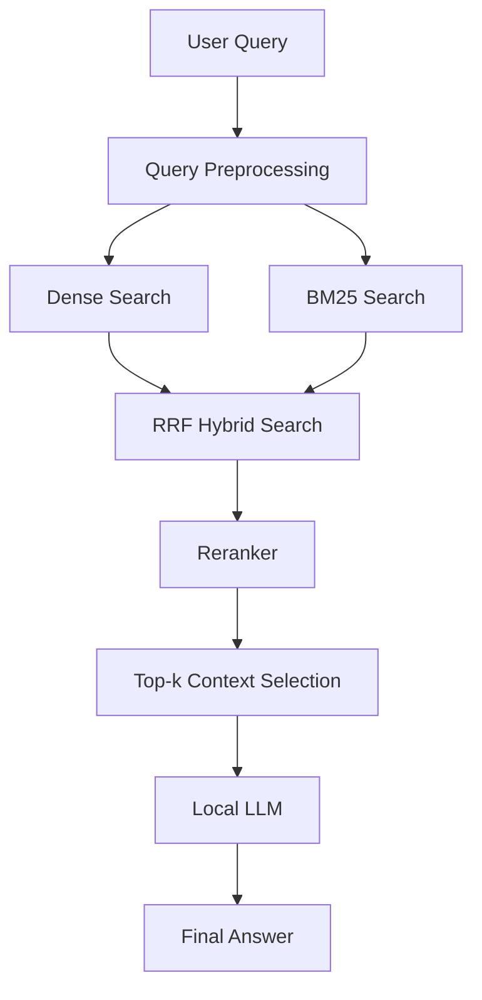

# Pipeline Details



## Step 1. Query Preprocessing

사용자 질문에서 BM25 검색에 필요한 핵심 토큰을 추출합니다. 한국어 조사, 어미, 의문어로 인한 노이즈를 줄이고 법령 도메인 복합어를 보존합니다.

## Step 2. Dense Search

`jinaai/jina-embeddings-v3`로 생성한 임베딩을 ChromaDB에 저장하고, 질문과 의미적으로 유사한 조문을 검색합니다.

## Step 3. BM25 Search

키워드 기반 검색으로 법령명, 조문명, 금액, 기간, 처벌 기준처럼 명시적인 표현이 중요한 질문을 보완합니다.

## Step 4. RRF Hybrid Search

Dense Search와 BM25 Search 결과를 RRF로 결합합니다.

```text
score(d) = Σ 1 / (k + rank_i(d))
```

## Step 5. Reranker

Hybrid Search 후보 문서를 질문과의 관련도 기준으로 재정렬합니다.

## Step 6. LLM Answer Generation

최종 상위 문서를 Context로 구성해 Local LLM에 전달하고, 근거 기반 답변을 생성합니다.
